[](https://opensource.org/licenses/MIT)

## Install package
Install the package using the following commands  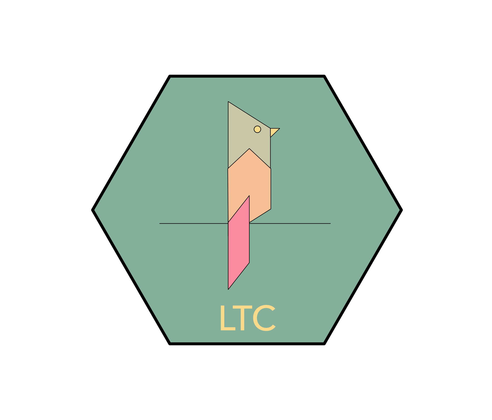

```r
# for now you can install the developemental version
# first you need to install the devtools package 
# in case you have not already installed
install.packages("devtools") 
# and load it
library(devtools)

# then you can install the dev version of the ltc
install_github("loukesio/ltc_palettes")
# and load it
library(ltc)
```

## All palettes

```r
# see the available palettes
names(palettes)
 [1] "paloma"     "maya"       "dora"       "ploen"      "olga"       "mterese"    "gaby"      
 [8] "franscoise" "fernande"   "sylvie"     "crbhits"    "expevo"        

# see the hex code from each palette 
palettes$paloma
[1] "#83AF9B" "#C8C8A9" "#f8da8a" "#f7bf95" "#fe8ca1"
 ```

## Palettes
### paloma
```r
# select the palette
paloma <- ltc("paloma")

#and print it with 
pltc(paloma)
```
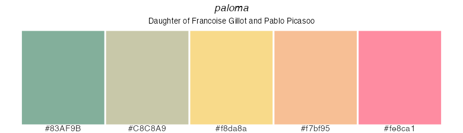

```r
# hex plot
pal=ltc("paloma",100,"continuous")
ggplot2::ggplot(data.frame(x = rnorm(1e4), y = rnorm(1e4)), aes(x = x, y = y)) +
  ggplot2::geom_hex() +
  ggplot2::coord_fixed() +
  ggplot2::scale_fill_gradientn(colours = pal) +
  ggplot2::theme_minimal()
```
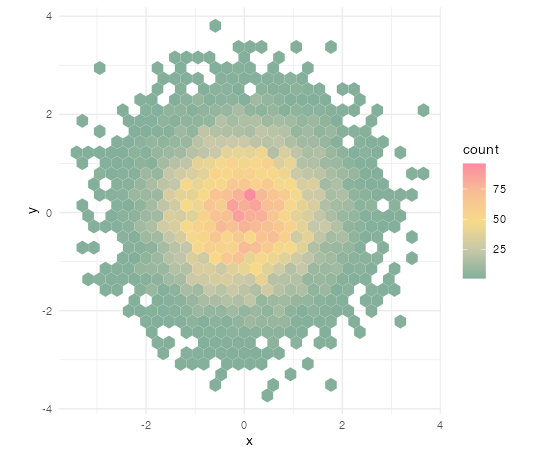

```r
# stakc plot
ggplot2::ggplot(diamonds, aes(price, fill = cut)) +
  ggplot2::geom_histogram(binwidth = 500, position = "fill") +
  ggplot2::scale_fill_manual(values = pal) +
  ggplot2::theme_bw() +
  ggplot2::theme(panel.grid.major = element_blank(), panel.grid.minor = element_blank())
```
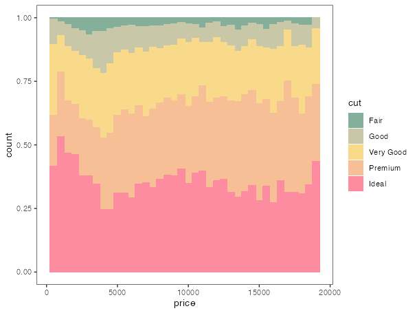

###
### maya

```
# select the palette
maya <- ltc("maya")

#and print it with 
pltc(maya)
```
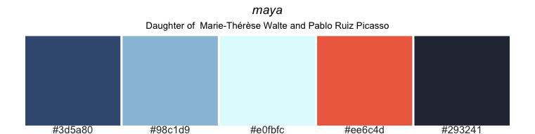

```r
pal=ltc("maya",100,"continuous")
ggplot2::ggplot(data.frame(x = rnorm(1e4), y = rnorm(1e4)), aes(x = x, y = y)) +
  ggplot2::geom_hex() +
  ggplot2::coord_fixed() +
  ggplot2::scale_fill_gradientn(colours = pal) +
  ggplot2::theme_minimal()
```
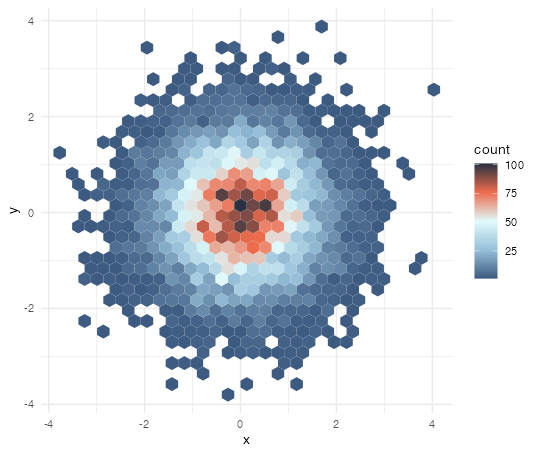

```r
pal=ltc("maya",7,"continuous")
ggplot2::gplot(diamonds, aes(price, fill = color)) +
  ggplot2::geom_histogram(binwidth = 500, position = "fill") +
  ggplot2::scale_fill_manual(values = pal) +
  ggplot2::theme_bw() +
  ggplot2::theme(panel.grid.major = element_blank(), panel.grid.minor = element_blank())
```
  
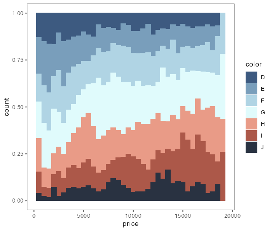

```r
pal=ltc("maya",7,"continuous")
plts(pal, main = "maya")
```
  
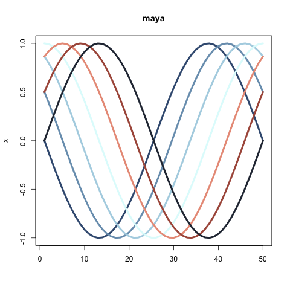

```r
pal=ltc("mterese",500,"continuous")
plts(col2transparent(pal, 75))
```

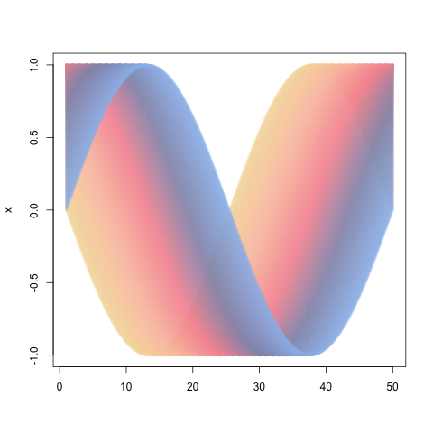

### dora

```
# select the palette
dora <- ltc("dora")

#and print it with 
pltc(dora)
```
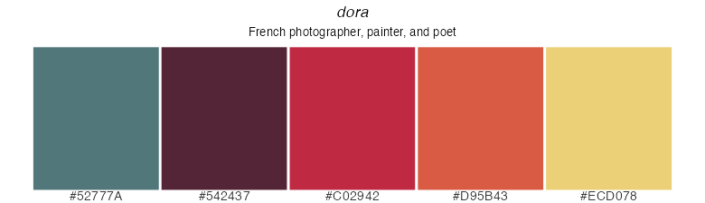

```r
library(ggplot2)
pal=ltc("dora",100,"continuous")
ggplot(data.frame(x = rnorm(1e4), y = rnorm(1e4)), aes(x = x, y = y)) +
  geom_hex() +
  coord_fixed() +
  scale_fill_gradientn(colours = pal) +
  theme_minimal()
 ```


```r
pal=ltc("dora",7,"continuous")
ggplot(diamonds, aes(price, fill = color)) +
geom_histogram(binwidth = 500, position = "fill") +
scale_fill_manual(values = pal) +
theme_bw() +
theme(panel.grid.major = element_blank(), panel.grid.minor = element_blank())
```
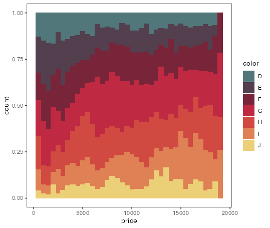

### ploen
```
# select the palette
ploen <- ltc("ploen")

#and print it with 
pltc(ploen)
```
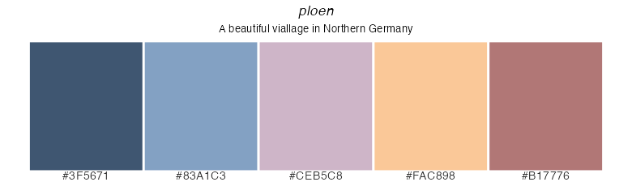

```r
library(ggplot2)
pal=ltc("ploen",100,"continuous")
ggplot(data.frame(x = rnorm(1e4), y = rnorm(1e4)), aes(x = x, y = y)) +
  geom_hex() +
  coord_fixed() +
  scale_fill_gradientn(colours = pal) +
  theme_minimal()
 ```

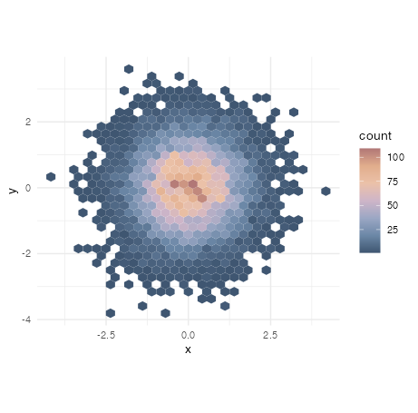

```r
pal=ltc("ploen",7,"continuous")
ggplot(diamonds, aes(price, fill = color)) +
geom_histogram(binwidth = 500, position = "fill") +
scale_fill_manual(values = pal) +
theme_bw() +
theme(panel.grid.major = element_blank(), panel.grid.minor = element_blank())
```
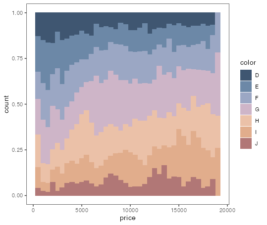


## Contributions
Loukas Theodosiou (theoodosiou@evolbio.mpg.de) and Kristian Ulrich have contributed to the development of this package. We have drawn inspiration from the following packages 1. https://github.com/jakelawlor/PNWColors and 2. https://github.com/karthik/wesanderson. A huge thank you to the developers of these beautiful packages.
