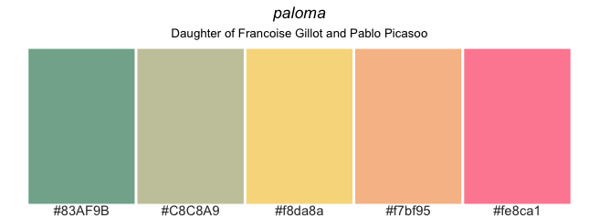
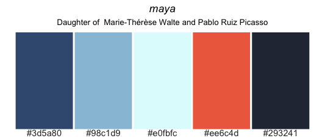

## Install package
Install the package using the following commands  


```r
# the dev version:
install.packages("devtools") 
library(devtools)

install_github("loukesio/ltc_palettes")
library(ltc)
```


## Palettes

Select the palette of interest: e.g., "paloma" wiht the function 

`paloma <- ltc("paloma")`

and print it with 

`pltc(paloma)`

#

#

## R/theodosiou

### License

This package is free software; you can redistribute it and/or modify it
under the terms of the GNU General Public License, version 3, as
published by the Free Software Foundation.

This program is distributed in the hope that it will be useful, but
without any warranty; without even the implied warranty of
merchantability or fitness for a particular purpose.  See the GNU
General Public License for more details.

A copy of the GNU General Public License, version 3, is available at
<https://www.r-project.org/Licenses/GPL-3>
